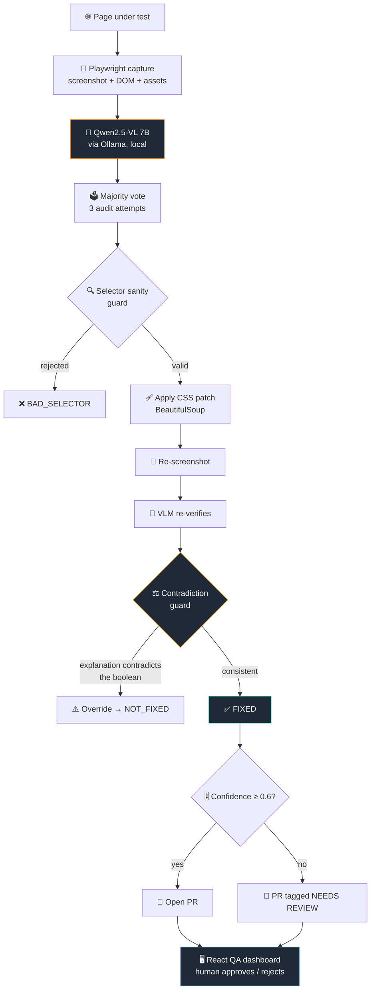

<div align="center">

# 🔍 OmniSight

### Multimodal UI Self-Healing & RPA Agent

**A vision-language model looks at a rendered page, names what is visually broken, patches the CSS, re-screenshots, and checks its own work — then opens a pull request only if it still believes the fix held.**

[](https://github.com/Ankit-builds1/omnisight/pull/6)
[](https://www.python.org/)
[](https://fastapi.tiangolo.com/)
[](https://react.dev/)

[](https://ollama.com/library/qwen2.5vl)
[]()
[]()
[]()

**Infotact Solutions — Advanced Generative AI Engineering Internship**

</div>

---

## 📖 What problem this solves

Selector-based UI tests (Selenium, Cypress) break the moment someone renames a CSS class, and they have no concept of *visual* correctness at all. A button can be clipped, overlapping, or invisible and the suite still reports green.

**OmniSight replaces the assertion with a vision-language model.** Playwright captures the real rendered page; the VLM examines the screenshot the way a human QA engineer would.

The engineering problem is not getting a VLM to describe a screenshot — that part is easy. It is that **the model is unreliable, and the pipeline has to work anyway.** Most of this codebase is the machinery that assumes the model is wrong.

---

## 📊 Measured results

From the committed run log (`ML/self_healing_log.json`, ML branch — 36 logged attempts across 2 pages):

| Outcome | Count | Meaning |
|---|---:|---|
| **FIXED** | **18** | Patch applied, re-screenshot verified, contradiction guard passed |
| NOT_FIXED | 15 | Re-verification found the defect still present |
| APPLY_FAILED | 2 | Patch could not be applied to the DOM |
| BAD_SELECTOR | 1 | Selector rejected by the sanity guard before application |

**50% verified repair rate**, with every failure mode logged separately rather than collapsed into a single pass/fail.

### The contradiction guard, and why it exists

The most interesting failure this project found: **the VLM returns `bug_still_present: false` while its own explanation describes the bug as still present.**

Real example from the pre-guard log:

```json
{
  "status": "FIXED",
  "evaluation": {
    "bug_still_present": false,
    "confidence_score": 0.95,
    "explanation": "The button's text is not visible, and the image appears
                    to be missing the button's content. The button's border
                    is fully visible, but the text is not readable."
  }
}
```

The boolean says fixed. The sentence says broken. Trusting the boolean ships a broken page.

**Before the guard** — of 16 `FIXED` verdicts in the earlier log, **7 were self-contradicting.** Real success was ~9/23, not 16/23.

**After the guard** — `sanity_check_evaluation()` scans the explanation for defect-indicating phrases whenever `bug_still_present` is false, and fails safe by overriding to true:

```python
if not bug_still_present:
    matched = [p for p in BUG_INDICATOR_PHRASES if p in explanation]
    if matched:
        evaluation["bug_still_present"] = True
        evaluation["contradiction_flagged"] = True
```

In the current log it **caught and overrode 8 evaluations** that would otherwise have been reported as successful repairs.

> This is a general observation about VLM self-evaluation, not a quirk of one prompt: the model's structured output and its natural-language reasoning can disagree, and only the reasoning is trustworthy.

---

## 🏗️ Pipeline



---

## 🔐 Safety layers

The system never trusts a single model output. Five independent checks:

| Layer | Implementation | Catches |
|---|---|---|
| **Majority voting** | `audit_image_reliable()`, 3 attempts, ties default to BUG_FOUND | Run-to-run detection inconsistency |
| **Selector sanity guard** | `sanity_check_selector()` | Cross-branch DOM hallucination — e.g. mixing nav elements with product-grid items |
| **DOM cross-check** | `backend/app/validators/dom_check.py` | Elements the model names that don't exist in the real HTML |
| **Contradiction guard** | `sanity_check_evaluation()` | `bug_still_present: false` conflicting with its own explanation |
| **Confidence gate** | Threshold 0.6 in `github_integration.py` | Low-confidence fixes reach a human, tagged `[NEEDS REVIEW]`, never silently merged |

Nothing merges without an explicit human approval click in the dashboard.

---

## 🌿 Repository layout & branch status

Work was split across three tracks. **`main` currently lags the `ML` branch** — see the table.

| Branch | Contents | Status |
|---|---|---|
| **`ML`** | `ML/feature_vlm.py` (29 KB) — voting, both guards, image cropping, heatmaps. 36-entry log across 2 pages. | ✅ **Most current.** Not merged to main. |
| `main` | `ML/vlm_test.py` (21 KB) — earlier script, **no contradiction guard**. 23-entry log, 1 page. Backend + dashboard are current here. | ⚠️ Behind `ML` |
| `backend-fastapi` | FastAPI service, GitHub integration, React dashboard | Merged into `main` |
| `frontend` | Playwright capture pipeline, per-page asset bundling | Merged into `main` |
| `fix/bug-1787929032` | Auto-generated branch from the self-healing loop → [PR #6](https://github.com/Ankit-builds1/omnisight/pull/6) | Merged |

> ⚠️ **Known gap:** the contradiction guard, majority voting, and selector sanity guard described above live in `ML/feature_vlm.py` on the `ML` branch. `main` still carries the older `ML/vlm_test.py`. Run the ML branch script for the full pipeline.

```text
omnisight/
├── ML/
│   ├── feature_vlm.py          # self-healing loop (ML branch — current)
│   ├── vlm_test.py             # earlier version (main)
│   ├── self_healing_log.json   # per-attempt audit log
│   └── heatmaps/               # attention visualisations (ML branch)
├── backend/
│   └── app/
│       ├── main.py                    # FastAPI entrypoint
│       ├── action_engine.py           # parse + validate VLM output
│       ├── github_integration.py      # PyGithub branch/commit/PR
│       ├── validators/dom_check.py    # DOM cross-check
│       └── test_dom_integration.py
├── dashboard/                  # React 18 + Vite QA review UI
├── proof/                      # before.png / after.png for PR #6
└── screenshots/                # captured pages + injected bugs
```

---

## ▶ Demo

There is no hosted demo, deliberately: the pipeline runs **Qwen2.5-VL 7B locally through Ollama**, which no free tier can host. The artifact is better than a demo URL —

**🔗 [PR #6 — an AI-authored, human-reviewed, merged pull request](https://github.com/Ankit-builds1/omnisight/pull/6)**

Fix generated by the loop, before/after screenshots attached as evidence, reviewed and merged through the dashboard. Proof images: [`proof/before.png`](proof/before.png) · [`proof/after.png`](proof/after.png).

---

## 🚀 Quick Start

**Prerequisites:** Ollama with `qwen2.5vl:7b` pulled, Python 3.11+, Node 18+.

```bash
ollama pull qwen2.5vl:7b
```

```bash
# Backend
cd backend/app && pip install -r requirements.txt && uvicorn main:app --reload --port 8000
```

```bash
# Dashboard
cd dashboard && npm install && npm run dev
```

```bash
# Self-healing loop — use the ML branch for the full guard stack
git checkout ML && cd ML && python feature_vlm.py
```

Dashboard: `http://localhost:5173` · API docs: `http://localhost:8000/docs`

---

## ⚠️ Honest limitations

- **The VLM cannot reliably localise defects.** It detects "something is clipped" but often names the wrong element — it flagged the Fleece Jacket when the injected bug was on the Backpack. Six prompt variants were tested; each traded recall for precision. This is a capability limit of a general-purpose 7B vision model, not a prompt gap.
- **False positives on clean pages are real.** Under Qwen2.5-VL, all three "clean" control pages returned `bug_found: true`. The DOM cross-check is what prevents this from producing bogus PRs.
- **Evaluated on 2 pages and one bug class** (button clipping). There is no labelled benchmark yet, so the 50% repair rate is descriptive of this sample, not a general performance figure.
- **No regression check.** Nothing verifies that a CSS patch didn't break *other* elements on the page.
- **Model inconsistency persists across models.** Qwen2.5-VL and MiniCPM-V showed comparable run-to-run variance.

---

## 🔭 Roadmap

- [ ] **Merge `ML` into `main`** so the guard stack ships by default
- [ ] **Labelled benchmark** — 30–50 injected bugs across varied pages with ground truth, to make every metric meaningful
- [ ] **Regression check** — screenshot-diff untouched regions, reject fixes that alter them
- [ ] Cost and latency per verified repair
- [ ] Comparative evaluation across VLMs on the benchmark
- [ ] Expand beyond clipping to overlap, contrast, and responsive-breakage classes

---

## 🛠️ Tech Stack

<div align="center">


**Vision** — Qwen2.5-VL 7B (Ollama) · Playwright · BeautifulSoup
**Backend** — FastAPI · PyGithub · Pydantic
**Frontend** — React 18 · Vite

</div>

---

<div align="center">

<sub>Built as part of Infotact Solutions' Advanced Generative AI Engineering internship.</sub>

<sub>Every number here comes from the committed run log — including the ones showing where the model fails.</sub>

</div>
